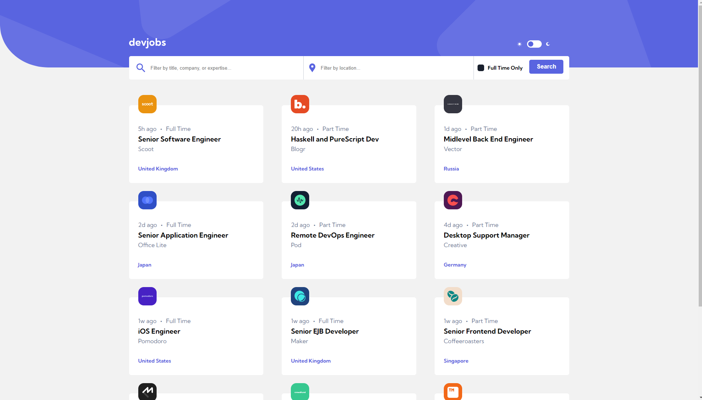

<h1 align="center"> Devjobs Web App</h1>

This website was developed for the Amalitech training program.

### Description
 - This is a website for job posting
   
 - The front end was created using HTML, CSS, and Vanilla JS
  
 - The data used for the solution is stored at `data/data.json`. 

##### Made with ♥ by: 

<a href="https://github.com/seths10">Seth Addo</a>

